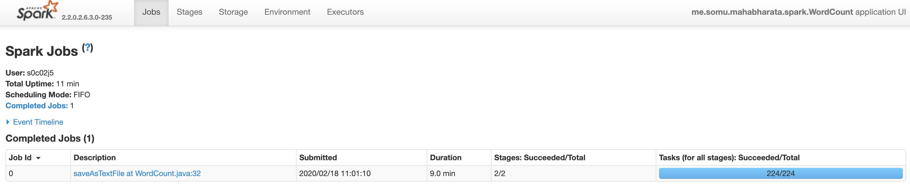
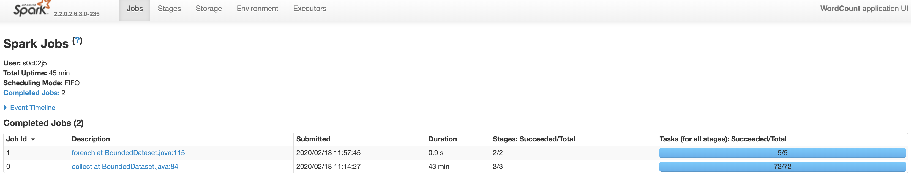
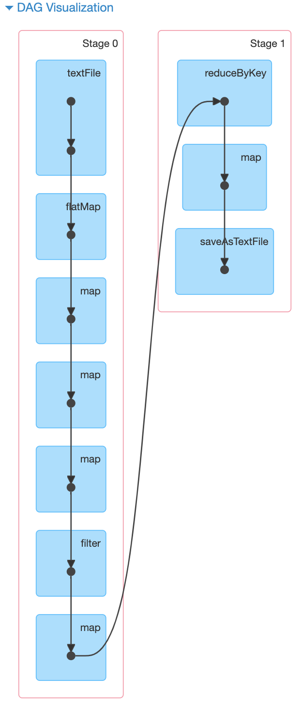
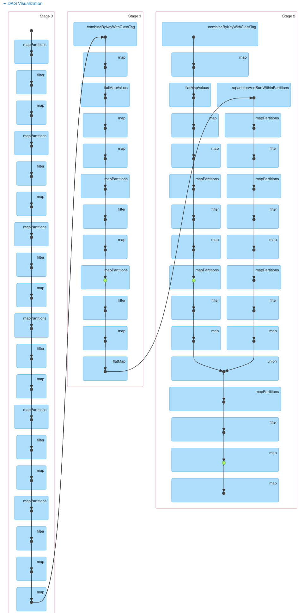
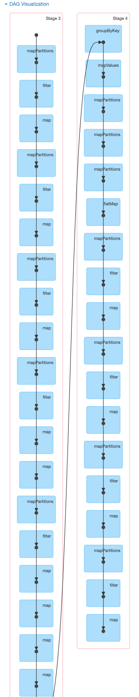

# Spark vs Beam

## Purpose
Comparison of [Apache Spark](https://spark.apache.org/) and [Apache Beam](https://beam.apache.org/) frameworks by running different use cases against a common dataset

## The Dataset
The dataset comprises of 18 text files that have a total size of around 14 MB.  You can find the dataset [here](books).\
For running my examples with a larger sized data set, I used simple unix commands to scale each file x1000 times to get a 14 GB dataset.\
For those whom it may interest,  the 18 text files in the dataset each represent one book or parva from [The Mahabharata](https://en.wikipedia.org/wiki/Mahabharata)

## Use Cases Compared

### Word Count
Word Count is the Hello World of distributed compute frameworks.  We used the text book word count samples provided in Spark's and Beam's official websites.
Here are the links to the [Spark Word Count Example](https://spark.apache.org/examples.html) and the [Beam Word Count Example](https://beam.apache.org/get-started/wordcount-example/)
We ran it on the 14 MB dataset and also on the 14 GB dataset.

#### Set Up
All runs were made on a YARN cluster with the datasets in HDFS.  For each run, we had 4 executors with 1 core per executor and 2 GB memory per executor.

#### Conclusion
**On the smaller 14MB dataset, Beam was 5% slower than Spark.  On the larger 14GB dataset though, Beam was a whopping 5 times slower than Spark!!** 

Here are the average execution times over 3 runs:

Dataset Size | Apache Spark | Apache Beam with Spark Runner | Result
-------------|--------------|-------------------------------|-------------
14 MB | 13.66 seconds | 14.33 seconds | Beam is ~ 5% slower than Spark
14 GB | 9.3 minutes | 43.6 minutes | Beam is 5 times slower than Spark

Here are screenshots of the Spark UI from one of the runs.  Note that for Spark only one job gets triggered for word count, while for Beam two jobs get triggered:

Apache Spark | Apache Beam with Spark Runner
-------------|---------------------------------
Only one job gets triggered  | Two jobs get triggered 
First Job Execution DAG  | First Job DAG  
Second Job Execution DAG Not Applicable | Second Job Execution DAG 
